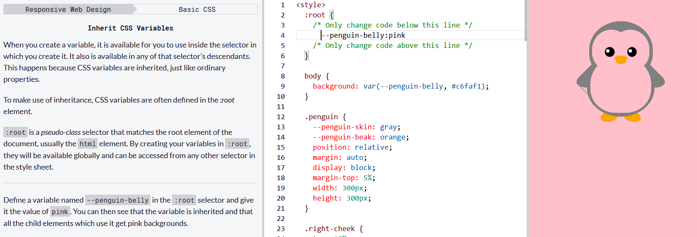

# 02- Basic CSS

However, an `id` is not reusable and should only be applied to one element. An `id` also has a higher specificity (importance) than a class so if both are applied to the same element and have conflicting styles, the styles of the `id` will be applied.

# Add a Negative Margin to an Element

An element's `margin` controls the amount of space between an element's `border` and surrounding elements.

If you set an element's `margin` to a negative value, the element will grow larger.

Try to set the `margin` to a negative value like the one for the red box.

Change the `margin` of the blue box to `-15px`, so it fills the entire horizontal width of the yellow box around it.

## Use Clockwise Notation to Specify the Padding of an Element

Instead of specifying an element's `padding-top, padding-right, padding-bottom`, and `padding-left` properties individually, you can specify them all in one line, like this:

    padding: 10px 20px 10px 20px;

These four values work like a clock: top, right, bottom, left, and will produce the exact same result as using the side-specific padding instructions.

## Use Attribute Selectors to Style Elements

You have been adding `id` or `class` attributes to elements that you wish to specifically style. These are known as ID and class selectors. There are other CSS Selectors you can use to select custom groups of elements to style.

Let's bring out CatPhotoApp again to practice using CSS Selectors.

For this challenge, you will use the `[attr=value]` attribute selector to style the checkboxes in CatPhotoApp. This selector matches and styles elements with a specific attribute value. For example, the below code changes the margins of all elements with the attribute `type` and a corresponding value of `radio`:

    [type='radio'] {
    margin: 20px 0px 20px 0px;
    }

## Understand Absolute versus Relative Units

The last several challenges all set an element's margin or padding with pixels (`px`). Pixels are a type of length unit, which is what tells the browser how to size or space an item. In addition to `px`, CSS has a number of different length unit options that you can use.

The two main types of length units are absolute and relative. Absolute units tie to physical units of length. For example, `in` and `mm` refer to inches and millimeters, respectively. Absolute length units approximate the actual measurement on a screen, but there are some differences depending on a screen's resolution.

Relative units, such as `em` or `rem`, are relative to another length value. For example, em is based on the size of an element's font. If you use it to set the `font-size` property itself, it's relative to the parent's `font-size`.

Note: There are several relative unit options that are tied to the size of the viewport. They are covered in the Responsive Web Design Principles section.

## Inherit Styles from the Body Element

Si on donne un style à l'element `body`, les autres element heritornt de ce style.

## Override Styles in Subsequent CSS

Applying multiple class attributes to a HTML element is done with a space between them like this:

    class="class1 class2"

**Note:** It doesn't matter which order the classes are listed in the HTML element.

However, the order of the `class` declarations in the `<style>` section is what is important. The second declaration will always take precedence over the first. Because `.blue-text` is declared second, it overrides the attributes of `.pink-text`

## Override Class Declarations by Styling ID Attributes

Le style déclarer dans un id prendra toujours le dessus sur le style d'une classe.

## Override Class Declarations with Inline Styles

inlide style > id > style dans l'ordre du haut vers le bas

We just proved that inline styles will override all the CSS declarations in your style element.

## Override All Other Styles by using Important

In many situations, you will use CSS libraries. These may accidentally override your own CSS. So when you absolutely need to be sure that an element has specific CSS, you can use !important.

    color: red !important;

## Use CSS Variables to change several elements at once

CSS Variables are a powerful way to change many CSS style properties at once by changing only one value.

Follow the instructions below to see how changing just three values can change the styling of many elements.

    .penguin {
    
    /* Only change code below this line */
    --penguin-skin: black;
    --penguin-belly: gray;
    --penguin-beak: yellow;
    /* Only change code above this line */
    
    position: relative;
    margin: auto;
    display: block;
    margin-top: 5%;
    width: 300px;
    height: 300px;
    }
    
    .penguin-top {
        top: 10%;
        left: 25%;
        background: var(--penguin-skin, gray);
        width: 50%;
        height: 45%;
        border-radius: 70% 70% 60% 60%;
    }

## Create a custom CSS Variable

To create a CSS variable, you just need to give it a name with two hyphens in front of it and assign it a value like this:

    --penguin-skin: gray;

This will create a variable named --penguin-skin and assign it the value of gray. Now you can use that variable elsewhere in your CSS to change the value of other elements to gray.

## Use a custom CSS Variable

After you create your variable, you can assign its value to other CSS properties by referencing the name you gave it.

    background: var(--penguin-skin);

This will change the background of whatever element you are targeting to gray because that is the value of the `--penguin-skin` variable. Note that styles will not be applied unless the variable names are an exact match.

## Attach a Fallback value to a CSS Variable

When using your variable as a CSS property value, you can attach a fallback value that your browser will revert to if the given variable is invalid.

Note: This fallback is not used to increase browser compatibility, and it will not work on IE browsers. Rather, it is used so that the browser has a color to display if it cannot find your variable.

Here's how you do it:

    background: var(--penguin-skin, black);

This will set background to `black` if your variable wasn't set. Note that this can be useful for debugging.

## Improve Compatibility with Browser Fallbacks

Il y a des incompatibilité aavec les navigateur et les variable CSS suivant les versions et si c'est **Internet Explorer**

This means that if you do want to provide a browser fallback, it's as easy as providing another more widely supported value immediately before your declaration. That way an older browser will have something to fall back on, while a newer browser will just interpret whatever declaration comes later in the cascade.

## Inherit CSS Variables
